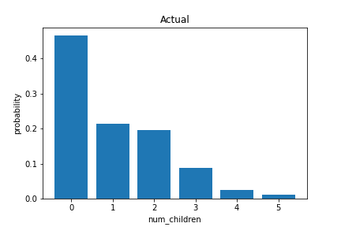
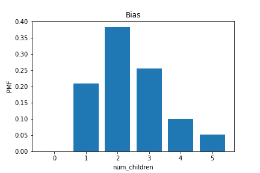

[Think Stats Chapter 3 Exercise 1](http://greenteapress.com/thinkstats2/html/thinkstats2004.html#toc31) (actual vs. biased)

#### Actual:

#### Bias:

#### PMF means:
actual mean: 1.024205155043831  
bias mean: 2.403679100664282
