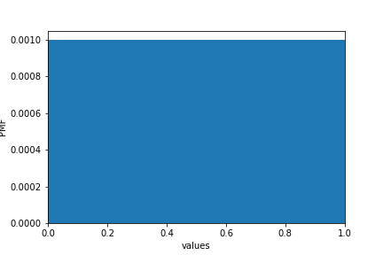
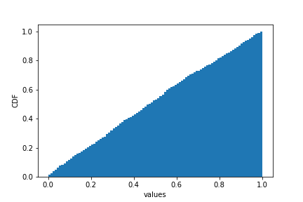

[Think Stats Chapter 4 Exercise 2](http://greenteapress.com/thinkstats2/html/thinkstats2005.html#toc41) (a random distribution)

####  PMF and CDF for random uniform distribution:
* The PMF should be a straight line since they are samples from a uniform distribution. ie the probabilities associated with each value will be the same prob(x) = 1/num_samples.  
* The CDF should be a diagonal line since no value in the distribution has a greater probability than the ones that precede it.

