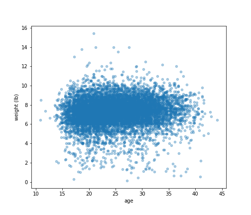
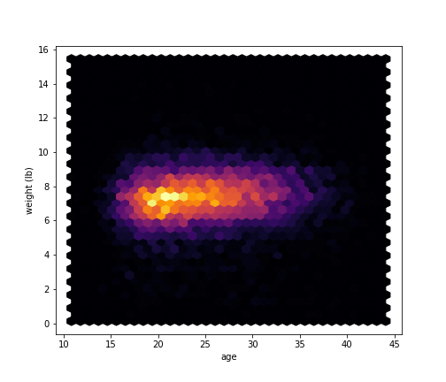
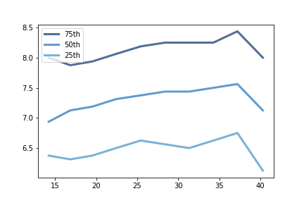

[Think Stats Chapter 7 Exercise 1](http://greenteapress.com/thinkstats2/html/thinkstats2008.html#toc70) (weight vs. age)

Pearson correlation coeff: 0.06883397035410908  
Spearman correlation coeff: 0.09461004109658226   

The spearman and pearson correlation coefficients between age and weight are very week 
however after looking at the data it's possible that there may be a non linear relationship 
between the two.
