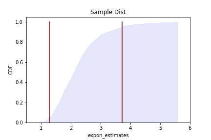
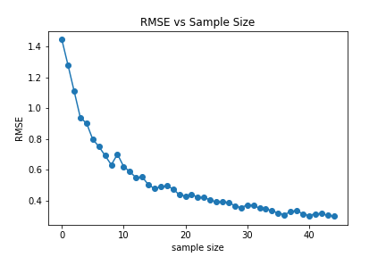

[Think Stats Chapter 8 Exercise 2](http://greenteapress.com/thinkstats2/html/thinkstats2009.html#toc77) (scoring)

### Exercise 8-1:
Mean error xbar with 1000 iterations -0.006220527601712476  
Mean error median with 1000 iterations -0.005275135799537794   

Mean error xbar with 100000 iterations 0.00017962760594859587 
Mean error median with 100000 iterations -0.0005995797492975744 

RMSE (biased) with 1000 iterations: 0.5293433096319883 
RMSE (unbiased) with 1000 iterations 0.6013656687574124  

RMSE (biased) with 100000 iterations: 0.5166232376736958 
RMSE (unbiased) with 100000 iterations 0.5793974619893391 

#### Conclusion: 
Increasing the number of simulations for estimating the mean and median did have an impact i.e. as the number of simulations increased the mean error for the mean and median approached 0, suggesting no clear bias. When running simulations for estimating variance
the biased estimator had a lower RMSE than the unbiased estimator even when the number of simulations increased.

### Exercise 8-2:
* Confidence interval: 1.2643307825818018 to 3.719350661228308

