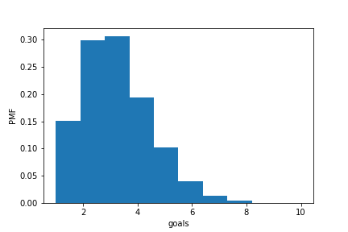

[Think Stats Chapter 8 Exercise 3](http://greenteapress.com/thinkstats2/html/thinkstats2009.html#toc77)

---

### Exercise 8-3:

* stderr 0.9975 
* RMSE 1.7301 
* confidence interval: (1, 6)
* As lambda increases the standard error doesnt change significantly, maybe I'm not understanding something about this question? 

---
